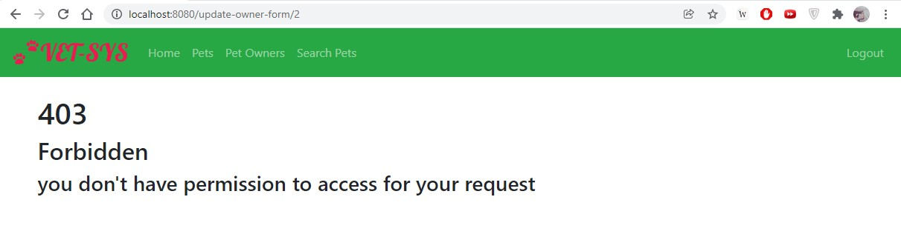
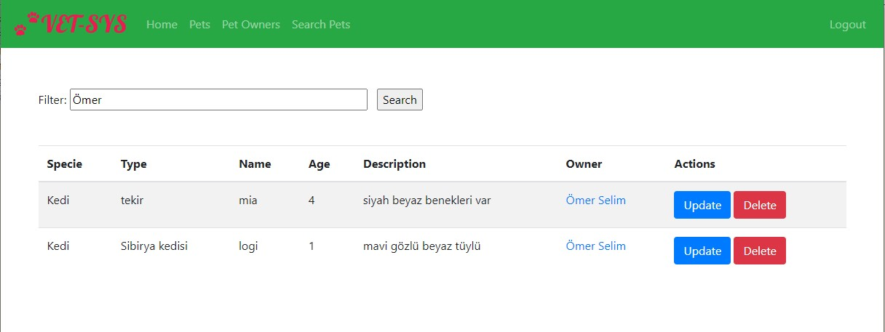

# SPRING BOOT VET MANAGEMENT SYSTEM

## Technology that used

| Technology                 | Description         |
|----------------------------|---------------------|
| Core Framework             | Spring Boot         |
| Security Framework         | Spring Security     |
| Persistent Layer Framework | Spring Data JPA     |
| Database                   | H2                  |
| Frontend                   | Bootstrap,Thymeleaf |

## How to run project
```shell
$ git clone https://github.com/omeratila7/vet-application.git
$ cd vet-application
$ mvn spring-boot:run
```

- Then got to **http://localhost:8080** with your browser.


This is our homepage if you want to use system you need to log in.


This is login page. System comes with 2 account user:user and admin:admin
If you want to test just type admin at username and password.


If you want to create new account you can create it from register page.


This is pet owners page. User can add new pet owners. If you want to update
and delete operations You need to log in as admin.



If a user which don't have admin permissions tries to update or delete owner .
they will direct to 403 page


This is pets page.As pet owners' user can add new pets but cannot update or delete
without admin.


As you can see, to add a new pet to the system et least one pet owner should be in db.




You can search pets from search pet tab by their name or owner's name.

Also, you can search by clicking owners name at pets or owners name. 

## Accessing data with H2 console

You can access H2 console with typing browser **http://localhost:8080/h2**

Fill the login form as follows and click on Connect:

* 	Saved Settings: **Generic H2 (Embedded)**
* 	Setting Name: **Generic H2 (Embedded)**
* 	Driver class: **org.h2.Driver**
* 	JDBC URL: **jdbc:h2:file:./database/testdb**
* 	User Name: **ryu**
* 	Password: **1597**


After you log in you can run SQL queries to do data operations.


